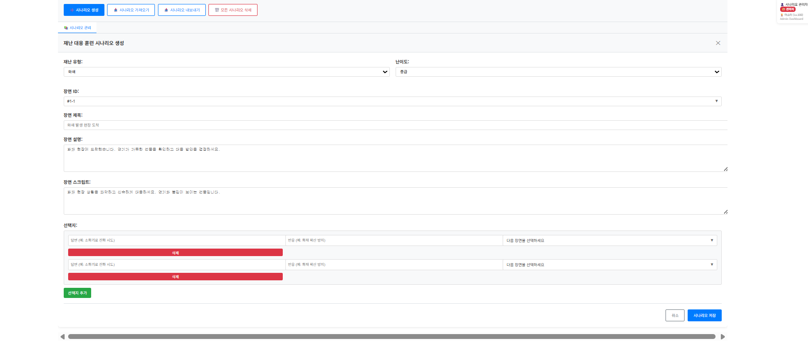
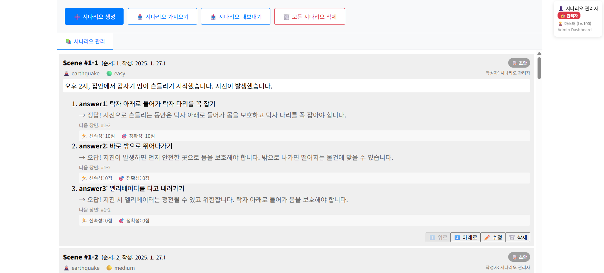

# Game Script Tool - 재난 대응 훈련 시나리오 생성기

## 🚨 **재난 대응 훈련 시나리오 생성 도구**

이 도구는 **재난 대응 훈련**을 위한 시나리오를 생성하는 웹 애플리케이션입니다.
기존의 게임 스크립트 도구를 재난 대응 훈련 목적에 맞게 수정했습니다.

## ✨ **주요 기능**

### **1. 재난 유형별 시나리오 생성**

- 🔥 **화재 대응**: 건물 화재, 산불 등
- 🌋 **지진 대응**: 지진 발생 시 대피 및 대응
- 🚑 **응급처치**: 부상자 응급처치 상황
- 🌊 **침수/홍수**: 홍수, 침수 상황 대응
- ⚡ **복합 재난**: 여러 재난이 동시 발생하는 상황

### **2. 난이도 설정**

- 🟢 **쉬움**: 초보자용 기본 훈련
- 🟡 **보통**: 일반적인 재난 대응 훈련
- 🔴 **어려움**: 고급 훈련자용 복잡한 상황

### **3. 점수 시스템**

- 🏃‍♂️ **신속성**: 빠른 대응 시간 (0-10점)
- 🎯 **정확성**: 올바른 선택과 행동 (0-10점)

### **4. 레벨업 시스템**

- ⭐ **경험치 (EXP)**: 정답 선택 시마다 경험치 획득
- 📈 **레벨업**: 경험치 누적으로 레벨 상승 (최대 100레벨)
- 🎁 **보너스**: 난이도별, 시나리오 유형별 추가 경험치
- 🏆 **성취감**: 레벨업 시 시각적 피드백 및 통계
- 🏅 **등급 시스템**: 초급자(1-20) → 중급자(21-40) → 고급자(41-60) → 전문가(61-80) → 마스터(81-100)

### **5. 시나리오 관리**

- ✅ **생성/수정**: 직관적인 폼 인터페이스
- 🔄 **순서 변경**: 드래그 앤 드롭으로 장면 순서 조정
- 📤 **Export/Import**: JSON 형식으로 백업 및 공유
- 🗑️ **삭제**: 개별 장면 또는 전체 시나리오 삭제

## 🖼️ **시각적 가이드**

### **1. 시나리오 생성 폼**



_재난 유형, 난이도, 장면 ID, 제목, 설명, 스크립트, 선택지 등을 설정할 수 있는 직관적인 폼 인터페이스_

### **2. 시나리오 관리 뷰**



_생성된 시나리오들을 카드 형태로 보여주고, 수정/삭제/순서 변경 등의 관리 기능을 제공_

## 🛠️ **기술 스택**

- **Frontend**: React 19 + TypeScript + Vite
- **State Management**: Zustand
- **Styling**: Styled Components
- **Local Storage**: 브라우저 기반 데이터 저장
- **Export/Import**: JSON 형식 시나리오 파일
- **Build Tool**: Vite (빠른 개발 및 빌드)
- **Package Manager**: npm/yarn 지원

## 📁 **프로젝트 구조**

```
src/
├── Components/
│   ├── ControlMenu/           # 상단 컨트롤 메뉴 (Add Scene Block, Export 등)
│   ├── ScriptView/            # 시나리오 목록 뷰
│   ├── Partials/
│   │   └── ScriptBlock.tsx   # 개별 시나리오 블록 표시
│   └── ApprovalManager/       # 승인 관리 (현재 미사용)
├── Stores/                    # Zustand 상태 관리
│   ├── atom.ts               # 상태 스토어 정의
│   └── selector.ts           # 상태 선택자
├── Utils/                     # 유틸리티 함수
│   └── api.ts                # 로컬 스토리지 및 Export/Import
└── types/                     # TypeScript 타입 정의
    └── index.ts              # ScriptBlock, User 등 인터페이스
```

## 🎯 **사용 방법**

### **1. 시나리오 생성**


1. "Add Scene Block" 버튼 클릭
2. 시나리오 ID 입력 (예: #1-1)
3. 재난 유형 선택 (화재, 지진, 응급처치 등)
4. 난이도 설정 (쉬움, 보통, 어려움)
5. 장면 제목 및 설명 작성
6. 장면 스크립트 작성 (사용자에게 보여질 메시지)
7. 선택지 및 점수 설정

### **2. 선택지 설정**

- **답변**: 사용자가 선택할 수 있는 행동 (예: "대피", "신고", "진화 시도")
- **반응**: 선택에 따른 결과 설명 및 피드백
- **다음 장면 ID**: 다음으로 진행될 장면 연결
- **점수**: 신속성, 정확성 점수 (0-10점)

### **3. 시나리오 연결**

- `nextId` 필드로 다음 시나리오와 연결
- 분기형 스토리텔링 구성 가능
- 순환 구조도 지원 (#END → #1-1)

### **4. 시나리오 관리**


- 생성된 시나리오들을 카드 형태로 확인
- 각 시나리오별 수정/삭제/순서 변경
- Export/Import 기능으로 백업 및 공유
- Add Ending Block으로 훈련 완료 장면 추가

## 📊 **데이터 구조**

### **ScriptBlock 인터페이스**

```typescript
interface ScriptBlock {
  sceneId: string; // 장면 ID (예: "#1-1")
  title?: string; // 장면 제목
  content?: string; // 장면 설명 (배경 정보)
  sceneScript?: string; // 장면 스크립트 (사용자 메시지)
  approvalStatus: ApprovalStatus; // 승인 상태
  createdAt: string; // 생성일시
  createdBy: string; // 작성자
  order: number; // 순서
  disasterType?: string; // 재난 유형 (fire, earthquake 등)
  difficulty?: string; // 난이도 (easy, medium, hard)
  options?: Array<{
    answerId: string; // 선택지 ID
    answer: string; // 선택지 텍스트
    reaction: string; // 선택 결과
    nextId: string; // 다음 장면 ID
    points: {
      speed: number; // 신속성 점수 (0-10)
      accuracy: number; // 정확성 점수 (0-10)
    };
  }>;
}
```

### **레벨업 시스템 인터페이스**

```typescript
interface User {
  id: string;
  name: string;
  role: UserRole;
  user_level: number; // 사용자 레벨 (1-20)
  user_exp: number; // 사용자 경험치
  total_score: number; // 총점
  completed_scenarios: number; // 완료한 시나리오 수
  created_at: string; // 계정 생성일
  updated_at?: string; // 마지막 업데이트일
}

interface UserProgress {
  user_id: string;
  user_level: number;
  user_exp: number;
  total_score: number;
  completed_scenarios: number;
  current_streak: number; // 연속 완료 횟수
  longest_streak: number; // 최장 연속 완료 횟수
  achievements: Achievement[];
  created_at: string;
  updated_at: string;
}

interface TrainingResult {
  score: number;
  totalQuestions: number;
  correctAnswers: number;
  timeSpent: number;
  completedAt: string;
  exp_gained: number; // 획득한 경험치
  level_before: number; // 훈련 전 레벨
  level_after: number; // 훈련 후 레벨
  level_up: boolean; // 레벨업 여부
  bonus_exp: number; // 보너스 경험치
}
```

### **경험치 계산 시스템**

```typescript
const EXP_CONSTANTS = {
  BASE_EXP_PER_CORRECT: 10, // 정답당 기본 경험치
  SPEED_MULTIPLIER: 1.5, // 신속성 보너스 배율
  ACCURACY_MULTIPLIER: 1.3, // 정확성 보너스 배율
  DIFFICULTY_BONUS: {
    // 난이도별 보너스
    easy: 1.0,
    medium: 1.2,
    hard: 1.5,
  },
  MAX_LEVEL: 20, // 최대 레벨
};
```

## 🔄 **Export/Import**

- **Export**: 생성된 시나리오를 JSON 파일로 저장
- **Import**: 기존 시나리오 파일 불러오기
- **Local Storage**: 브라우저에 자동 저장 (`me.phoenix.game-script-tool`)
- **DB Schema 호환**: Export 시 MySQL 스키마에 맞는 형식으로 자동 변환

## 🚀 **개발 완료된 기능**

### **✅ 완료된 기능**

- ✅ 기본 시나리오 구조 및 UI
- ✅ 재난 유형별 분류 시스템
- ✅ 선택지 및 점수 시스템
- ✅ 시나리오 생성/수정/삭제
- ✅ 순서 변경 기능
- ✅ Export/Import 기능
- ✅ 로컬 스토리지 자동 저장
- ✅ TypeScript 타입 안전성
- ✅ Zustand 상태 관리
- ✅ Vite 빌드 시스템
- ✅ 반응형 UI 디자인
- ✅ 레벨업 시스템 데이터 구조 설계
- ✅ 경험치 계산 시스템 설계

### **⏳ 향후 개발 계획**

#### **High Priority (1-2주)**

- ⏳ 사용자 인증 및 권한 관리
- ⏳ 팀별 데이터 격리
- ⏳ 시나리오 승인 워크플로우

#### **Medium Priority (3-4주)**

- ⏳ 훈련 결과 분석 및 통계
- ⏳ 실시간 훈련 진행 모니터링
- ⏳ 모바일 최적화

#### **Low Priority (5-6주)**

- ⏳ 사운드/배경 이미지 통합
- ⏳ 고급 통계 및 보고서
- ⏳ 다국어 지원

## 📝 **라이선스**

- **출처**: [1000ship/game-script-tool](https://github.com/1000ship/game-script-tool)
- **라이선스**: 자유 사용 허가 (제작자: 1000ship)
- **수정**: 재난 대응 훈련 목적으로 Phoenix 프로젝트에서 수정

## 🤝 **기여하기**

재난 대응 훈련 시나리오 개선에 기여하고 싶으시다면:

1. 이슈 등록
2. 기능 제안
3. 버그 리포트
4. 코드 리뷰

---

**Phoenix 재난 대응 훈련 시스템**의 일부로 개발되었습니다. 🚨
